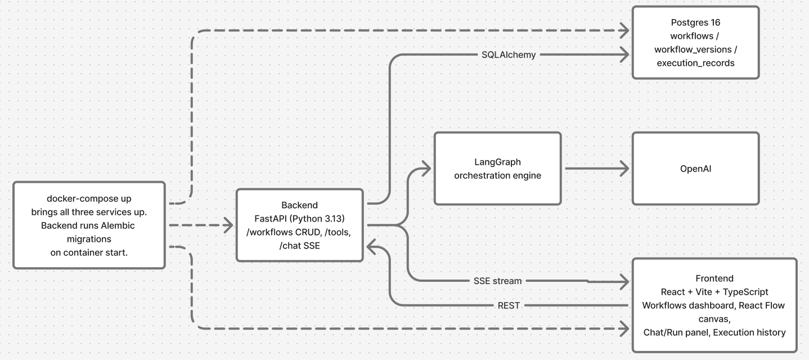
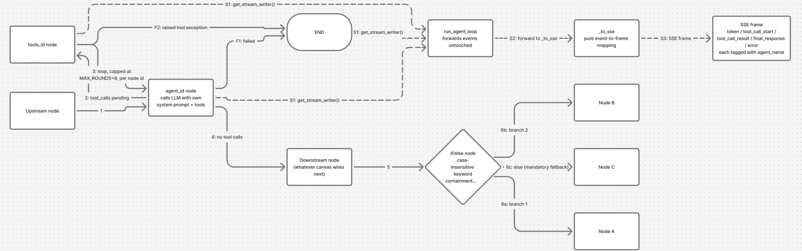

# Architecture and design decisions

## Overview

The app is a monorepo with two halves and a database:

One `docker-compose up` brings all three up, and the backend runs its Alembic migrations on container start.

## One graph representation

The decision everything else hangs off: React Flow's node/edge JSON is the executable format. The canvas saves `{nodes: [{id, type, position, data}], edges: [{id, source, target, sourceHandle}]}`, and the backend validates that same shape ([schemas.py](backend/app/schemas.py)) and compiles it into a LangGraph `StateGraph` ([agent.py:208](backend/app/agent.py#L208)). There is no workflow DSL in between, and nothing that translates one representation into another.

That does leak a UI library's serialization format into the domain model. `position` is persisted even though execution ignores it, and `sourceHandle` is React Flow's vocabulary rather than the app's. The payoff is that a visual edit and the executed behavior cannot drift apart, because they are the same data. Wiring two nodes on the canvas edits the thing that runs.

Validation lives in one Pydantic `model_validator` on `WorkflowGraph`, so an invalid graph is rejected at the API boundary before the compiler ever sees it: exactly one start node, at least one agent, unique agent names, agents with exactly one outgoing edge, if/else nodes with one edge per branch plus a mandatory `else`, no unknown tools, and no sticky notes wired into the flow. The canvas mirrors those rules in `isValidConnection` so bad wiring is prevented at drag time rather than rejected at save time, but the backend re-checks all of it regardless.

## AI orchestration

Each agent node on the canvas compiles to two LangGraph nodes, `agent_<id>` and `tools_<id>`, wired to each other with conditional edges: an agent-pair loop (agent calls the LLM, tool calls run, loop back, capped at `MAX_ROUNDS = 8`), which on exit routes to whatever the canvas wires downstream, an if/else node, another agent pair, or an end node, with two separate failure edges (from the agent on an LLM error or round-cap, and from the tools node on a raised exception) both going straight to `END` without looping back.

An agent calls the LLM with its own system prompt, its own enabled tools, and its own output format. That is what makes the system configurable rather than one hardcoded agent with knobs on it: a graph can chain several agents with different personas and different tool grants, and each keeps an independent tool-call loop and round budget, since `rounds` is keyed by node id instead of being global.

`_build_graph` resolves nodes lazily and memoizes by node id. Shared downstream nodes, agent chains, and if/else fan-in then all work without special cases, and a cyclic reference terminates because a node already being compiled is already in the `compiled` map.

### Routing

If/else nodes compile into real LangGraph nodes with conditional edges rather than being evaluated in application code. Branch matching is deliberately crude: case-insensitive keyword containment against the upstream agent's final answer, with a reserved `else` fallback. It pairs with the per-agent `output_format: "json"` option, which sets `response_format` and appends a JSON instruction to the prompt, so a classifier agent can be pushed toward emitting a predictable token to branch on.

### Streaming

Streaming is a side-channel running alongside the graph above, not a stage in it. Every node emits into it, agent nodes and tools nodes and end nodes alike, via `get_stream_writer()`. `run_agent_loop` forwards whatever the nodes write without inspecting it, and the endpoint's only job is `_to_sse`, a pure mapping from event dataclass to SSE frame. The `agent_name` tag on every event is what lets the UI attribute a step to the right agent in a multi-agent run.

### The LLM seam

`llm.py` is the only module that touches the OpenAI SDK. Everything above it sees `ContentDelta | ToolCallRequest | StreamDone` and nothing else. That is what lets the whole test suite run against real HTTP endpoints with only the LLM stubbed, without mocking SDK chunk shapes or patching inside the agent loop. `web_search` follows the same pattern, isolating the Tavily HTTP call in `_call_tavily`.

Multiple LLM providers were dropped from scope on purpose (see [spec.md](.scratch/ai-workflow-builder/spec.md)). The `LLMClient` Protocol is the seam a second provider would slot into, but no second implementation exists, because writing one nothing currently needs would be speculative.

## Tools

Tools are a registry of `ToolSpec(schema, fn)` keyed by name ([registry.py](backend/app/tools/registry.py)). Adding one means writing a module that exports a `SCHEMA` dict and a function returning a string, then adding a line to `TOOLS`. The agent loop, the graph compiler, and the frontend all stay untouched: `/tools` serves the registry to the canvas, which renders the checkboxes, `tool_schemas(enabled)` filters by the node's grant list, and `_tools_node` dispatches by name.

Five tools ship: `calculator`, `web_search` (real, via Tavily), `send_email` (a mock that logs instead of sending), `fetch_webpage`, and `get_current_datetime`.

Tool functions always return `str`, including for errors ("Error: TAVILY_API_KEY is not configured"). Handing the error back to the model instead of raising lets the agent recover or explain itself rather than killing the run. Real exceptions are caught at the dispatch boundary and surfaced as an `error` event, since tools are the untrusted edge of the system.

## Persistence and versioning

Three tables carry everything:

- `workflows` is the mutable identity: `name`, `current_version_id`, and denormalized `graph`/`system_prompt`/`enabled_tools` columns.
- `workflow_versions` is an immutable snapshot, written on every save.
- `execution_records` is one row per chat run, pinned to a `workflow_version_id`.

The denormalized columns on `workflows` exist so the dashboard can render a card without a join. Execution always reads the pinned version's graph instead. That trade is written down at [workflows_api.py:45](backend/app/workflows_api.py#L45) so the duplication doesn't look accidental.

Run pinning is the reason versioning exists, and it works end to end. When a chat opens, the frontend captures `current_version_id` once into a ref ([useAgentChat.ts:65](frontend/src/hooks/useAgentChat.ts#L65)) and resends it on every turn. `/chat` resolves that version and returns 404 if it doesn't belong to the workflow, instead of quietly falling back to the current one. Editing a workflow mid-conversation therefore cannot retroactively change a run already in flight: the client sets the pin, the server enforces it, and the execution record stores it.

`current_version_id` is deliberately not a database-level foreign key, because `workflows` to `workflow_versions` to `workflows` would be a circular FK. Version rows are immutable and never deleted, so the integrity problem the FK would catch never comes up. The cost is that deleting a workflow has to remove children in dependency order by hand, since no `ON DELETE CASCADE` is set.

Execution records are written incrementally rather than on completion ([executions.py](backend/app/executions.py)), so a run that errors or gets interrupted mid-stream still leaves a visible history entry. Token deltas are skipped as too chatty to store per-delta, while tool calls, the final response, and errors commit as they happen. The recorder opens its own session from a session factory, because FastAPI closes the request-scoped `Depends(get_db)` session before the SSE generator body runs at all. That one is a subtle enough trap that both `get_session_factory` and the recorder carry comments explaining it.

## Frontend

React 19 with Vite and TypeScript. There is no router and no state-management library: navigation is a discriminated union in `App.tsx` (`list | editor | chat | history`), and at four views a router would be more machinery than the problem needs.

`useAgentChat` holds the SSE event state machine for a conversation. Both the standalone Chat page and the editor's Run panel use it, so "chat with a saved workflow" and "test the graph I'm editing" render off identical logic instead of two implementations that slowly diverge. It tracks each turn twice: a flat `steps` list for the linear chat transcript, and `runs` grouped by agent name for the Run panel's per-agent sections.

SSE arrives via `fetch` plus a hand-rolled `ReadableStream` parser rather than `EventSource`, because `EventSource` cannot issue POST requests and the chat payload is a POST body.

## Testing

One seam: the FastAPI HTTP layer via `TestClient`, against a real SQLite in-memory database per test. 68 tests cover workflow CRUD, graph validation, the agent tool-call loop, if/else routing, multi-agent chaining, execution history, and each tool. Only the genuine external boundaries are stubbed, meaning the OpenAI client and the Tavily call.

No lower seam was introduced. Tests never call tool functions directly or invoke the compiled graph, because those are internals that should stay free to change. What gets asserted is request in, response out. SQLite stands in for Postgres because no Postgres-specific types are used. Frontend and browser tests were scoped out.

## Process

The build ran off a spec and eleven tickets under [.scratch/ai-workflow-builder/](.scratch/ai-workflow-builder/), sequenced under one hard constraint: a complete, working, demoable product had to exist at every step boundary. Tracer bullet (hardcoded workflow, real OpenAI loop, SSE, bare UI), then persistence, then the LangGraph swap-in, then the canvas, then branch nodes, then the bonus features. Ticket 03, the LangGraph swap-in, changed no observable behavior by design. It replaced a working manual loop with the real orchestration substrate while the tests stayed green.

## Known gaps

- `agent_node_data` picks the first agent node for the denormalized `system_prompt` column. Harmless for display, but misleading on a multi-agent workflow.
- No auth and a single user, scoped out deliberately for a local app.
- `MAX_ROUNDS = 8` is a constant rather than per-workflow configuration.
- Branch matching is keyword containment, which is coarse. It is honest about being a simple decision layer instead of pretending to be a rules engine, and the JSON output format is the intended way to make it reliable.
